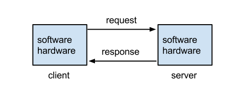
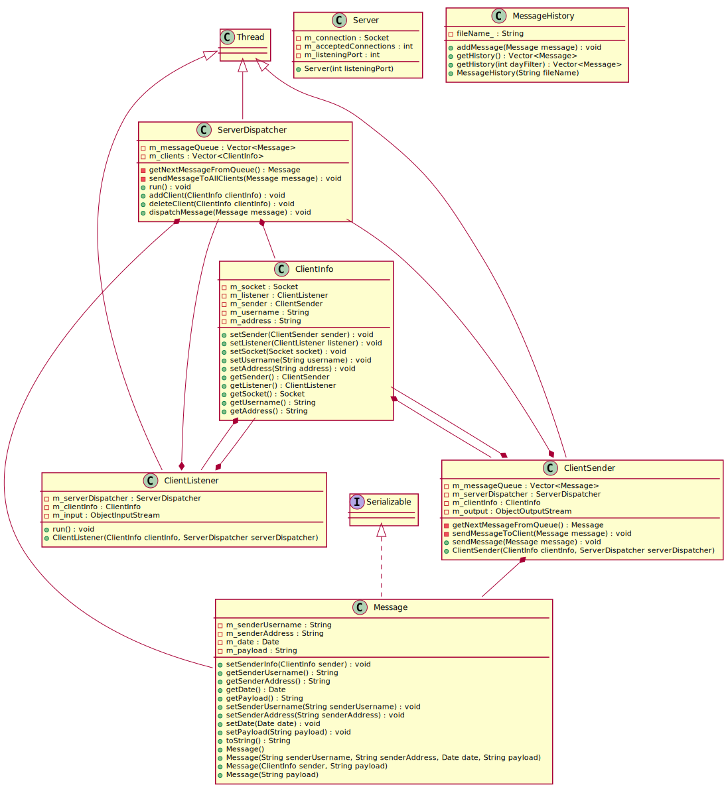
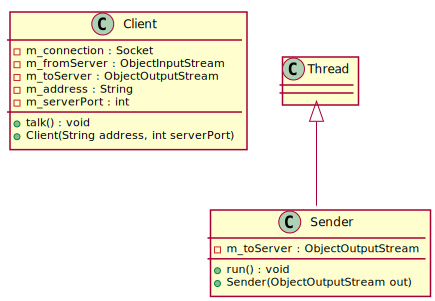

= Chatline multiclient
Chen Lijun 4E <chenlijun5858@gmai.com>
:doctype: book
:toc: left
:numbered:
:icons: font
:source-highlighter: highlightjs

== Introduzione

"`__Chatline multiclient__`" è nato come progetto supplementare
all'area di progetto della classe 4E dell'istituto _IISS Galileo Galilei_.

L'area di progetto in questione riguarda principalmente la materia _Sistemi e reti_.
Si tratta infatti di costruire una LAN (_**L**ocal **A**read **N**etwork_)
usando dispositivi di rete (switch e router), questi ultimi forniti dalla scuola.

Ora, avendo una LAN, si è anche pensato di testarlo con qualcosa
di concreto e, perché no, divertente.
Così è nato, a seguito alla proposta del professor Antimo Marzochella, il presente
progetto, che ha come fine ultimo, quello di integrare la materia _Informatica_
nella sopracitata area di progetto.

== In cosa consiste il progetto

Questo progetto consiste nel *completamento* di un applicazione _client-server_,
di cui una prima bozza viene già fornita dal docente,
che permetta la comunicazione immediata di uno o più utenti attraverso la rete.

In particolare ai singoli alunni è stato richiesto di sviluppare la funzionalità che
permetta di salvare le conversazioni in un file di testo, che poi dovrà poter essere
letto per presentare ad ogni utente che si collega al server una storia dei messaggi
precedenti.

L'implementazione dell'applicazione è stata svolta tramite uno dei linguaggi 
più famosi e usati: Java.

.Applicazione client-server
****
Un tipo di applicazione in cui ci sono almeno due programmi in esecuzione:

* il server: programma che resta in attesa delle richieste di servizio da parte di uno o più client
* il client: programma che inizializza una connessione, attraverso la quale
si collega al server e può richiedere a questo servizi di cui ha bisogno.

Di fatto il client-server è solo un modo di strutturare un applicazione e non
obbliga l'uso di tecnologie specifiche: basta che ci sia un componente in attesa
di richiesta e uno che compie tali richieste e che quindi i due comunichino
in qualche modo, tramite qualche via o mezzo.

Di fatto però quando ci si riferisce a questo tipo di applicazione, si intende
che il server e il client comunicano tramite rete e in particolare tramite Socket.

****

== Modello del applicazione

== Funzionamento

=== Codice Sorgente completo

.Client.java
[source,java]
----
include::./../src/Client.java[]
----

.Server.java
[source,java]
----
include::./../src/Server.java[]
----

.ServerDispatcher.java
[source,java]
----
include::./../src/ServerDispatcher.java[]
----

.ClientSender.java
[source,java]
----
include::./../src/ClientSender.java[]
----

.ClientListener.java
[source,java]
----
include::./../src/ClientListener.java[]
----

.Message.java
[source,java]
----
include::./../src/Message.java[]
----

.MessageHistory.java
[source,java]
----
include::./../src/MessageHistory.java[]
----

.ClientInfo.java
[source,java]
----
include::./../src/ClientInfo.java[]
----
