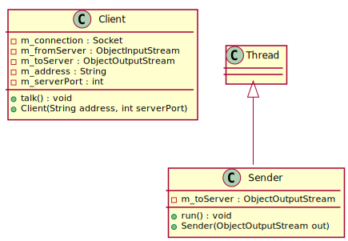
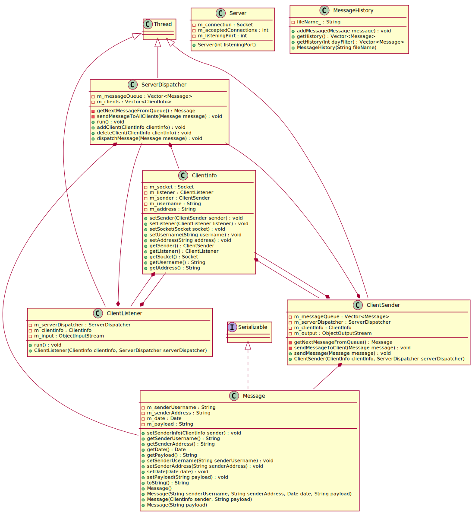
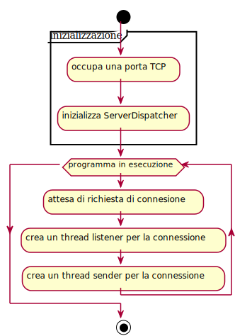
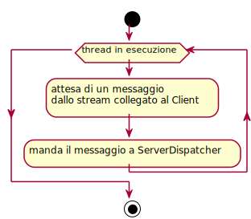
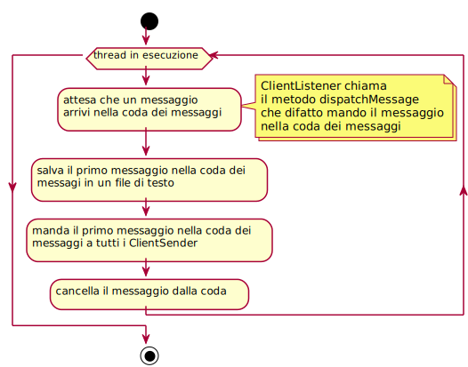
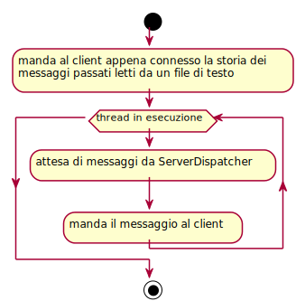
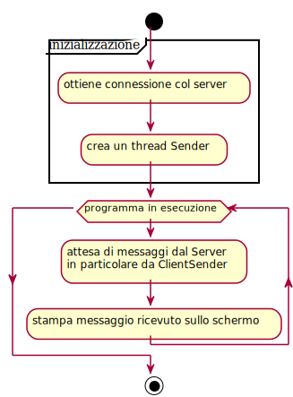
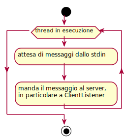

= Relazione su "`Chatline multiclient`"
Chen Lijun 4E <chenlijun5858@gmai.com>
:doctype: book
:toc: left
:toclevels: 4
:numbered:
:icons: font
:source-highlighter: pygments

== Introduzione

"`__Chatline multiclient__`" è nato come progetto supplementare
all'area di progetto della classe 4E indirizzo informatico dell'istituto _IISS Galileo Galilei_.

L'area di progetto in questione riguardava principalmente la materia _Sistemi e reti_.
Consisteva infatti nella creazione di una LAN (_**L**ocal **A**read **N**etwork_)
usando dispositivi di rete (switch e router), questi ultimi forniti dalla scuola.

Ora, avendo una LAN, si è anche pensato di testarlo con qualcosa
di concreto e, perché no, divertente.
Così è nato, a seguito alla proposta del docente di _Informatica_ Antimo Marzochella, il presente
progetto, che ha come fine ultimo, quello di integrare le conoscenze e abilità
maturate durante l'anno scolastico 2016-2017 inerenti alla programmazione con il
quanto appreso in _Sistemi e reti_.

=== In cosa consiste il progetto

Il presente progetto consiste nel *completamento* di un applicazione _client-server_,
di cui una prima versione funzionante era già stata fornita dal docente.

L'applicazione, che d'ora in poi denomineremo "`**_Chatline_**`", disponeva inizialmente
di un server a cui più client si potevano connettere.
In questo caso il server non faceva altro che smistare i messaggi
 in arrivo a tutti gli altri client che
sono connessi ad quest'ultimo (quello che fa un Hub).

Ai singoli alunni è stato dunque richiesto di sviluppare la funzionalità che
permetta di salvare le conversazioni in un file di testo, che poi dovrà poter essere
letto per presentare ad ogni utente che si collega al server una storia dei messaggi
precedenti.

.Applicazione client-server
****
Un tipo di applicazione in cui ci sono almeno due programmi in esecuzione:

* il server
* il client

Server::
programma che resta in attesa delle richieste di servizio da parte di uno o più client
Client::
programma che inizializza una connessione, attraverso la quale
si collega al server e può richiedere a questo servizi di cui ha bisogno.

Il modello client-server è solo un modo di strutturare un applicazione e non
obbliga l'uso di tecnologie specifiche: basta che ci sia un componente che offra
dei servizi e uno che li usufruisce e che quindi i due comunichino
in qualche modo.

Di fatto però, quando si parla di applicazione client-server, si intende
un applicazione di rete in cui questi ultimi comunicano tramite la rete,
e in particolare tramite *_Socket_*.

image::./images/client-server_model.svg[title="Modello client-server"]
****

.Socket
****
Un socket rappresenta un punto di connessione, cioè identifica univocamente un 
processo (quindi un servizio) all’interno di un computer. Un socket è formato da
un indirizzo IP e una porta TCP.

Ad ogni applicazione in esecuzione che usa TCP (o UDP) come protocollo di trasporto viene 
infatti associato dal sistema operativo un numero identificativo, chiamato porta.

Le porte virtuali sono 65.535, di cui le prime 1.023 sono dette _Well Known Port_, 
in quanto associate a servizi noti come HTTP, FTP, ecc.
****

=== Materiali usati

Linguaggio di programmazione utilizzato: *_Java_*.

Java::
Linguaggio imperativo, a tipizzazione statica, orientato agli
oggetti (OOP), interpretato (dalla JVM) e cross-platform.

Per la stesura del codice si è fatto ricorso a:

* *_Vim_* insieme a vari plugins (sopratutto _Eclim_) per la stesura del codice
* Siti come https://stackoverflow.com/[Stack Overflow] e in generale https://www.google.it[Google]
* *_Git_*: famoso programma di controllo versione

Invece per l'elaborazione della relazione sono stati usati i seguenti programmi

* *_Asciidoctor_*: programma che traduce in formati quali HTML, PDF, EPUB, etc.
file scritti nel linguaggio a marcatori _Asciidoc_
* *_Plantuml_*: programma che fornisce un linguaggio dichiarativo e sulla base
di questo genera immagini (diagrammi di classi, flow-chart, etc.) appropriati

== L'applicazione

=== Esecuzione dell'applicazione

.Esecuzione server
[source,sh]
----
$ java Server <porta TCP>
----

.Esecuzione client
[source,sh]
----
$ java Client <indirzzo server> <porta TCP>
----

=== Struttura dell'applicazione

=== Funzionamento generale dell'applicazione

==== Lato server

* Il server occupa una porta TCP.
* Il server crea un thread a parte, _ServerDispatcher_, che si occupa
di inoltrare i messaggi a tutti i client.
* Il server resta in attesa di una richiesta di connessione.
* Al ogni richiesta a di connessione il server crea 2 thread separati,
uno che aspetta di ricevere messaggi dal client (__ClientListener__) e l'altro che si occupa
di inviare i messaggi al client (__ClientSender__), associati alla connessione tramite
un oggetto della classe _ClientInfo_. +
Per cui ogni ClientSender e ClientListener avrà come membro la _ClientInfo_
a cui è associato.
* Il server poi aggiunge al ServerDispatcher le informazioni (__ClientInfo__)
riguardo la connessione appena creata (ServerDispatcher possiede un elenco
di connessioni a cui poi inoltrerà i messaggi).
* Quando arriva un messaggio al server, il _ClientListener_ chiamerà
il metodo della classe _ServerDispatcher_ che si occupa di inoltrare
il messaggio a tutti i client mandandoli al _Sender_ associato.

==== Lato client

* Il client fa una richiesta di connessione.
* Dopo aver ottenuto l'accettazione dal server, il client crea
un thread a parte che si occupa di mandare i messaggi al server,
mentre il main-thread fungerà da listener.

=== Codice Sorgente completo

==== Client.java
[source,java]
----
include::./../src/Client.java[]
----

==== Server.java
[source,java]
----
include::./../src/Server.java[]
----

==== ServerDispatcher.java
[source,java]
----
include::./../src/ServerDispatcher.java[]
----

==== ClientSender.java
[source,java]
----
include::./../src/ClientSender.java[]
----

==== ClientListener.java
[source,java]
----
include::./../src/ClientListener.java[]
----

==== Message.java
[source,java]
----
include::./../src/Message.java[]
----

==== MessageHistory.java
[source,java]
----
include::./../src/MessageHistory.java[]
----

==== ClientInfo.java
[source,java]
----
include::./../src/ClientInfo.java[]
----

== Conclusione

Questa esperienza è stata senza dubbio molto utile
per i singoli alunni, dato che spesso nell'ambito scolastico
ci si limita a scrivere piccoli programmi (dove per piccoli si
intende che non superano nemmeno le cento righe di codice) avendo
come unico scopo quello di imparare una determinata sintassi.

Diversamente invece, nella realizzazione di questo progetto, si ha potuto
provare un esperienza che si avvicina di più alla programmazione professionale.

Si è infatti partiti dalla lettura di un codice sorgente
scritto da terze parti, finendo col
aggiungere nuove funzionalità sulla base del codice fornito.

E questo è certamente significativo dal punto di vista
formativo, visto che nella programmazione la manutenzione occupa
molto più tempo di quello usato per l'implementazione.
Imparare sin da subito a leggere programmi scritti da altri
è fondamentale anche se spesso trascurato.

Nello sviluppo di "`Chatline`" invece abbiamo avuto la fortuna
di sviluppare queste abilità, che in un futuro prossimo, per chi
deciderà di continuare con la programmazione, sarà il pane
quotidiano.
